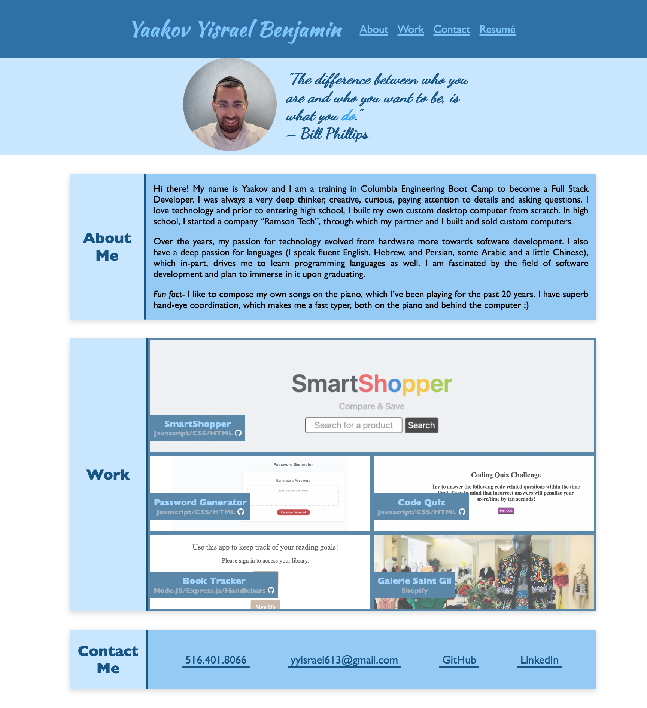

# Portfolio

## Description
This portfolio of work is a showcase of projects that I have created, demonstrating my skills and talents. Also includes information about myself, including contact info.

## License

  
This project is licensed under the MIT License.

For more information on this license, please visit [their website](https://www.mit.edu/~amini/LICENSE.md).

## Deployment
[Deployment Link](https://yyb613.github.io/portfolio)

## Contact
If you have any questions, you can find me [here](https://yyb613.github.io/portfolio).
